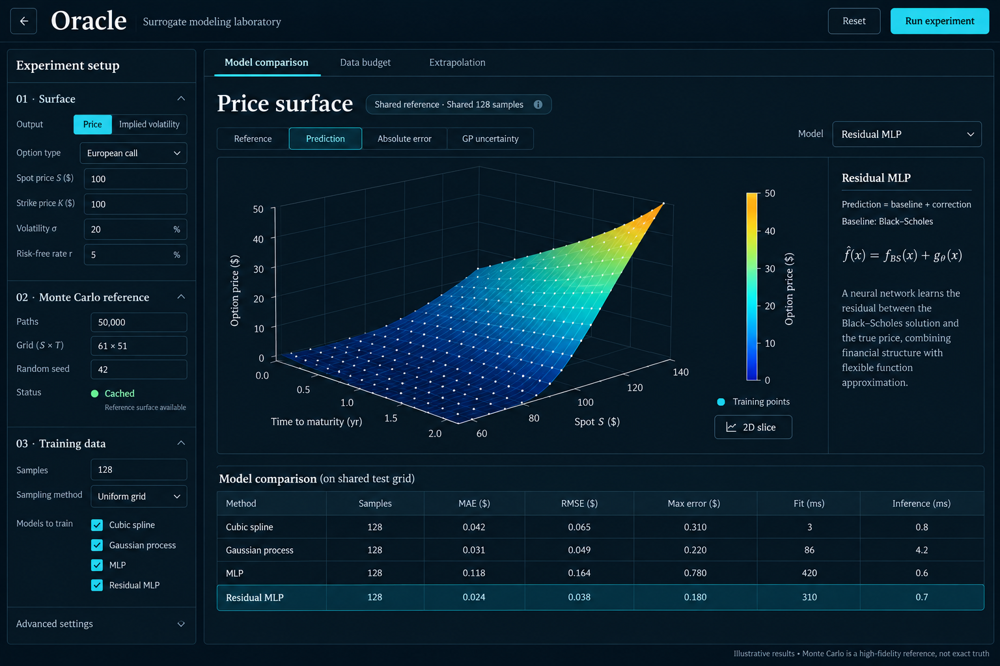

# UI and interaction specification

## Selected visual reference

Use this image for hierarchy, proportions, density, and styling. Implement real controls and charts rather than placing a raster screenshot in the application. Numerical axes, curves, typography details, and copy follow the specifications here and in the numerical plan.

## Shell and visual tokens

- Desktop header: approximately 68px, back link to `/#home`, Georgia “Oracle” wordmark, muted “Surrogate modeling laboratory,” Reset, and cyan Run experiment.
- Left rail: approximately 300–326px with its own scrolling area on wide screens. Main content takes the remaining width and scrolls naturally within the tool viewport.
- Main area: experiment tabs, title/provenance, view controls, a dominant surface plot, an inline method explanation, then the comparison table.
- Use existing tokens: background `#03101d`, surface `#061725`, raised surface `#0a1d2d`, thin borders `#203545`/`#334452`, text `#f2f5f5`, muted text `#a8b4bd`, cyan `#24d5e7`, soft cyan `#8cebf2`.
- Headings use the shared Georgia serif stack; controls, tables, plot labels, and ordinary copy use the shared system sans-serif stack. Equations use existing math rendering.
- Use modest 4–5px corners, restrained spacing, and tabular numerals. No decorative backgrounds on the tool route, oversized KPI cards, or unrelated dashboard navigation.
- Chart series use distinct labels and markers/line patterns in addition to color. Use a readable sequential colormap for error/uncertainty; zero remains meaningful.

## Experiment rail

### 01 · Surface

Price / Implied volatility segmented control, call/put selector, strike, volatility, continuously compounded rate, and dividend yield. Show spot and maturity domain controls, including units. A nominal spot of 100 supplies the initial slice/readout location; the surface evaluates every spot on the domain.

Keep domain controls discoverable in a collapsible Surface domain subsection. Do not hide financially material assumptions under ML settings. Values shown as percentages convert to decimal API values exactly once.

Selecting IV from the untouched price preset applies the verified IV preset: spot 80–120 and maturity 0.25–2 years. Announce the changed bounds. Preserve deliberate compatible settings; for a user-edited domain including zero maturity, explain the IV constraint and require a positive lower bound rather than silently changing custom bounds. Zero-maturity IV remains unsupported.

### 02 · Monte Carlo reference

Path count, grid dimensions, seed, and status: Not generated / Generating / Ready / Reused / Out of date. Show reference identity in concise form with full configuration available in a disclosure.

Explain “Paths are simulations per reference estimate; training samples are surface points given to a surrogate.” Separate these controls visually. The reference grid is the dense evaluation surface, not the surrogate training set.

Antithetic sampling is on by default. Advanced numerical controls can expose it, but exact terminal GBM sampling does not require an arbitrary time-step control.

### 03 · Training data

Supported count selector with displayed tensor shape, sampling label “Uniform tensor grid,” and four method checkboxes. Default 128 displays “8 × 16 = 128 points.” A user can select any nonempty method subset.

Show actual count and validation messages before running. Do not silently change a requested count. See the numerical plan for why counts are constrained.

Advanced settings expose the bounded GP kernel/noise controls and shared MLP width, epochs, learning rate, and regularization. Direct and residual MLP default to matching network/training settings. Baseline identity stays visible even while advanced settings are closed.

## Main experiment tabs

**Model comparison:** The approved view. One primary surface and common metrics table.

**Data budget:** Retain the same rail and shell. Replace the primary surface area with a large error-versus-samples chart. Separate tabs select RMSE, MAE, maximum error, fit time, or inference time. Do not combine incompatible units or calculate a composite score. Selecting a completed budget loads its surface and table into the comparison view without recomputation. Display completed-budget count and cancellation control during sweeps.

**Extrapolation:** Retain the same layout, adding training-domain bounds and a visible training rectangle in a 2D domain inset/slice. Default training region is the central 70% of both reference axes, snapped inward to actual grid nodes. Labels report the realized bounds. Main plot evaluates the full reference domain. Table toggles All valid / Inside training domain / Outside training domain. Changing the training region never changes the reference automatically.

## Surface views

| View | Display and behavior |
| --- | --- |
| Reference | MC values; reference standard-error summary in method/context detail |
| Prediction | Selected method; context panel shows its equation, assumptions, and warnings |
| Absolute error | `abs(prediction − reference)` on a common comparison mask; zero-based color range shared across selected methods |
| GP uncertainty | GP latent predictive standard deviation; available only when a successful GP result exists |

GP uncertainty must not display another method's uncertainty. If GP was computed, choosing this view selects GP explicitly and updates its model label. If GP is absent or failed, disable the control with a visible reason.

Training dots appear at the actual sampled reference coordinates and target values, not arbitrary mesh vertices. On an error surface, place dots at the error evaluated at those training coordinates. On an uncertainty surface, place dots at corresponding predictive standard deviation. Tooltips retain reference target values so marker height is unambiguous.

Reference and prediction use shared target scales for comparison. Error and uncertainty have separate nonnegative scales and explicit units. Keep camera and axis domain stable across compatible method/view changes; reset when the coordinate domain changes. Never retain a price z-axis range for IV.

The 2D slice control opens a spot slice at a selected grid maturity, using an accessible slider/select. Draw the reference and all selected successful methods with clear legends. GP uncertainty bands, when enabled, are labeled model uncertainty and are not MC confidence bands. Provide a compact numeric table for the slice.

## Method explanation

The inline explanation area is secondary to the plot and can collapse. It changes with the active method:

- Cubic spline: interpolation on a tensor grid; edge/extrapolation behavior and potential overshoot.
- GP: kernel, noise approximation, and latent predictive standard deviation.
- MLP: direct mapping from coordinates to target; architecture, epochs completed, convergence warning.
- Residual MLP: `prediction = baseline + learned correction`, baseline identity and baseline-only error.

Use “Monte Carlo reference,” never “true price” or “exact truth.” For GBM, disclose why its same-parameter Black–Scholes baseline is especially strong and why IV is expected to be flat.

## Comparison table

Rows remain in method order: Cubic spline, Gaussian process, MLP, Residual MLP. Selecting a row selects the plotted method. Columns: Method, Samples, MAE, RMSE, Max error, Fit (ms), Inference (ms). Price errors use currency units; IV errors use volatility percentage points. Show reference generation time separately above or below the table.

Default summary is “Full valid reference grid,” with evaluation count and an “Unseen grid points” toggle. Explicitly state that the full-grid metric includes training nodes. Region selection in extrapolation composes with this toggle. Undefined metrics display an em dash and explanation, never zero.

Partial failures keep their row with a failure reason and no fabricated numbers. No trophy, winner badge, automatic ranking, or overall score. Show a partial-comparison notice when methods failed or coverage differs.

## State and transition behavior

| State | Required behavior |
| --- | --- |
| Initial | Valid defaults; instructional empty chart; no automatic expensive run |
| Invalid | Inline errors, focused summary on run attempt, no request |
| Generating reference | Stage label, indeterminate activity, Cancel; previous results remain labeled with their own configuration |
| Fitting | Method/budget stage text where known; no fictional percent complete |
| Complete | Committed configuration, shared-data identity, metrics, and diagnostics |
| Inputs edited | Mark previous results “Previous experiment — inputs changed”; no relabeling or auto-run |
| Cancelled | Stop queued work, abort current request, keep previous/completed results with accurate provenance |
| Failed | Actionable error and Retry through Run; preserve last successful experiment |
| Partial sweep | Completed budgets visible; incomplete budgets explicitly absent/cancelled |
| API unavailable | Clear connection message; controls and documentation still usable |

Run commits an immutable configuration snapshot. Editing experiment parameters during work cancels that run and marks results stale. View-only changes do not cancel or recompute. Reset cancels, restores defaults, clears result/cache state, and restores focus to a sensible control without reloading the entire page.

## Responsive behavior and accessibility

- At wide widths, preserve the selected rail/plot/table layout. At medium widths, move the method explanation below the plot before squeezing plot labels.
- Below approximately 700px, prioritize chart and experiment status; open controls in an accessible sheet following Ithaca's pattern. Provide Escape, focus containment, focus restoration, and a labeled close button.
- Ensure usable layouts at 390px, 768px, and 1440px widths and at 200% zoom. Allow a labeled horizontal scroll region for the table rather than shrinking text.
- Use native buttons, inputs, disclosures, table headers, keyboard-operable tabs, visible cyan focus, labeled unit suffixes, and live status announcements that do not spam each epoch.
- Provide chart summaries, slice values, region counts, and error/uncertainty explanations outside WebGL. Respect reduced motion and do not auto-rotate surfaces.
- Runtime UI must not contain the mockup's “Illustrative results” footer; it must show real result provenance. Retain that label only on design artifacts.
