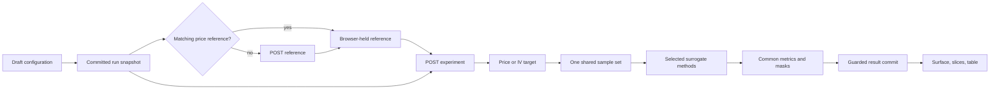

# Architecture and contracts

## Existing integration points

| Existing path | Planned use |
| --- | --- |
| `apps/web/src/App.tsx` | Add lazy Oracle route, title, description, indexing rule, and existing error boundary |
| `apps/web/src/styles.css` | Reuse shared color and typography tokens |
| `apps/web/src/workbench.css` | Reuse compatible visual primitives without inheriting Ithaca's three-column layout accidentally |
| `apps/web/src/components/NumberField.tsx` | Reuse labeled numerical input where its API fits |
| `apps/web/src/components/Math.tsx` | Reuse equation rendering |
| `apps/web/src/components/ChartPanel.tsx` | Reuse exported `ScientificPlot`; extract only if Oracle needs a clean shared event/camera seam |
| `apps/web/src/lib/api.ts` | Reuse same-origin base URL, abort, timeout, and error-handling conventions; minimally extract common transport if needed |
| `apps/web/src/IthacaWorkbench.tsx` | Follow accessible control-sheet pattern; add stronger run-identity guards in Oracle rather than assuming abort alone prevents stale commits |
| `apps/web/src/troy/troy.css` | Follow rail, tab, metrics, chart-card, and responsive proportions |
| `apps/web/src/site/HomePage.tsx` | Replace the third Coming soon card when Oracle is release-ready |
| `services/solver-api/app/main.py` | Register Oracle router and use the shared execution capacity |
| `services/solver-api/app/execution.py` | Reuse cooperative cancellation and deadline checks |
| `services/solver-api/app/solvers/monte_carlo.py` | Reuse/extract GBM and paired-error primitives while preserving Ithaca results |
| `services/solver-api/app/solvers/black_scholes.py` | Reuse market data and analytical baseline pricing |
| `services/solver-api/pyproject.toml` | Existing NumPy/SciPy suffice for the proposed numerical stack |
| `vercel.json` | Existing `/v1/*` and SPA rewrites already match the proposed route shapes; verify rather than redesign |

Oracle owns separate request/result types. Do not add surrogate names to Ithaca's `SolverMethod` union: they describe a different experiment.

## Proposed file ownership

These are intended boundaries, not a requirement to create empty files before they contain real behavior.

```text
apps/web/src/oracle/
  OracleWorkbench.tsx       shell and experiment composition
  OracleParameters.tsx     controlled configuration sections
  OracleSurface.tsx        surface, overlays, camera, and slice
  OracleComparison.tsx     common metric table and selection
  OracleBudget.tsx         sweep controls and curves
  OracleMethodDetails.tsx  equations, limitations, diagnostics
  useOracleExperiment.ts   run lifecycle and in-memory reuse
  api.ts                   Oracle request/response adaptation
  types.ts                 domain, result, and UI-state types
  validation.ts            client validation from capability limits
  oracle.css               tool-scoped layout

services/solver-api/app/oracle/
  router.py                capabilities, reference, experiment endpoints
  models.py                strict input/output contracts
  reference.py             reusable MC reference envelope
  implied_volatility.py    bounded inversion and masks
  sampling.py              common tensor-grid training data
  evaluation.py            metrics, regions, diagnostics, timings
  baseline.py              existing Black–Scholes baseline and residual arithmetic
  preprocessing.py         training-only normalization
  experiment.py            preprocessing and method orchestration
  surrogates.py            cubic and GP adapters, common result interface
  mlp.py                   bounded network, training, residual adapter

services/solver-api/tests/
  test_oracle_reference.py
  test_oracle_iv.py
  test_oracle_sampling.py
  test_oracle_surrogates.py
  test_oracle_evaluation.py
  test_oracle_api.py

apps/web/src/oracle/
  validation.test.ts
  useOracleExperiment.test.tsx
  OracleWorkbench.test.tsx
```

Keep the baseline interface small and internal. Do not introduce a plugin registry, database repository, generic workflow engine, or model serialization service.

## End-to-end flow



Reference reuse is browser-memory reuse, not a promise of server-session affinity. The frontend resends the bounded reference envelope for fitting. This is intentionally simple for a stateless FastAPI deployment and avoids a distributed cache or persistent worker requirement.

## API surface

### `GET /v1/oracle/capabilities`

Return `schema_version`, supported targets/sides/methods, supported tensor budgets and shapes, all dimension/combined-compute limits, default settings, algorithm version, and cancellation/transport description. The frontend validates against these values and the backend validates independently. Do not send a request if capabilities cannot be loaded; explain service availability.

### `POST /v1/oracle/reference`

Request:

```text
schema_version: 1
market: {strike, volatility, rate, dividend}
option_side: call | put
domain: {spot_min, spot_max, spot_nodes, tau_min, tau_max, tau_nodes}
monte_carlo: {paths, seed, antithetic}
```

Return a `PriceReference` envelope:

```text
schema_version, algorithm_version, reference_id
configuration: canonical validated request
axes: {spots: number[], times_to_maturity: number[]}
prices: number[][]
price_standard_errors: number[][]
timing: {reference_ms}
diagnostics: {effective_independent_samples, sampling, correlation_note}
warnings: structured warning[]
```

The nominal UI spot is not an extra hidden simulation parameter. It selects a slice/readout; the spot axis defines the reference. The reference key includes every actual generation input, including domain, random seed, antithetic setting, and algorithm version.

### `POST /v1/oracle/experiment`

Request:

```text
schema_version: 1
reference: PriceReference
target: price | implied_volatility
sampling: {
  strategy: uniform_tensor,
  budget: 16 | 32 | 64 | 128 | 256,
  training_bounds: {spot_min, spot_max, tau_min, tau_max}
}
methods: nonempty unique list of cubic_spline | gaussian_process | mlp | residual_mlp
settings: {gp, mlp, residual_baseline: black_scholes}
training_seed: bounded integer
```

The server derives target values, validates the shared lattice, fits selected methods sequentially, evaluates, and returns `ExperimentResult`. A target-only change reuses the raw price reference when the domain is unchanged. IV conversion may be recomputed per request; it is separately timed and does not regenerate MC. If measured conversion cost warrants reuse later, add it explicitly rather than assuming a hidden cache.

The client must not supply separate per-method training arrays. The server derives one sample set from the envelope. Validate all posted arrays, finiteness, shapes, axis ordering, coordinate/configuration consistency, standard-error signs, bounds, and canonical hash before numerical work. A content hash detects mismatch, not authenticity; it is not proof that arbitrary API clients generated their data using this service. The product UI uses only reference responses it obtained itself and has no upload feature.

Budget sweeps call this endpoint once per budget, sequentially, with the same reference and shared settings. Do not introduce a long-running background-job endpoint. An entire budget result commits atomically; completed budgets survive cancellation of the next request.

## Result contract

```text
ExperimentResult:
  schema_version, algorithm_version, experiment_id
  reference_id, sample_set_id
  configuration_snapshot
  axes
  target: {kind, internal_unit, display_unit, error_display_unit, values, valid_mask, invalid_reasons}
  samples: {row_indices, column_indices, flat_indices, values, count, bounds, shape}
  evaluation: {reference_valid_mask, training_mask, inside_mask, outside_mask}
  methods: SurrogateResult[]
  timings: {iv_conversion_ms, sampling_ms, evaluation_ms, request_compute_ms}
  warnings

SurrogateResult:
  method, status: complete | failed
  predictions: nullable matrix
  absolute_errors: nullable matrix
  predictive_stddev: nullable matrix, GP only
  metrics: {
    full, unseen, inside, outside, unseen_inside, unseen_outside
  }
  timing: {fit_ms, inference_ms, prediction_count}
  training_count
  diagnostics: typed method-specific fields
  baseline_metrics: optional, residual MLP only
  warnings
  error: optional {code, message}

MetricSet:
  count, mae, rmse, max_abs_error
```

Use JSON `null` for unavailable values and masked cells; never serialize NaN or Infinity. A valid result matrix has exactly the reference shape. Metric values are null when count is zero. A failed method has no success metrics. All result labels are derived from `configuration_snapshot`, not the currently edited form.

The phase 1 target contract additionally carries `version`, `target_id`, `reference_id`, axes, pointwise standard-error estimates, and conversion timing. IV uses `decimal_volatility` internally, `percent_volatility` for displayed values, and `volatility_percentage_points` for errors. These labels are separate to avoid confusing a volatility value with an error difference.

The IDs hash canonical versioned content. `reference_id` identifies raw reference data/configuration; `sample_set_id` includes reference, target conversion version, sampler version, bounds, indices, and training values. `experiment_id` additionally includes methods, settings, and training seed. These are reproducibility identities, not database keys or security credentials.

## Error and partial-success semantics

- Input/schema/domain/compute-limit failures: 422 with structured field/error information.
- Service capacity unavailable: 503, consistent with existing solver behavior.
- Deadline: 504 with a clear bounded-compute message.
- Disconnected client: cooperative cancellation; no UI dependency on receiving a 499 response.
- Individual numerical fit failure: return an explicit failed method beside successful methods when the shared experiment is valid.
- Invalid shared target/lattice/reference: fail the experiment as a whole; never change samples for one method.
- All methods failed: return a completed response containing failed rows, displayed as experiment failure rather than a successful comparison.
- Internal exceptions: sanitized error plus existing request ID; preserve useful server diagnostics without exposing request internals in UI.

## Frontend state and cache

Separate `draftConfig`, `committedConfig`, `activeRun`, `lastCompletedResult`, and `sweepResults`. Use a monotonically increasing run ID plus AbortController. Before every success, error, or finally-state mutation, verify the run ID is current. Pass already-aborted signals correctly and abort on unmount, reset, configuration edits, or a replacing run.

Keep at most two price references in an in-memory LRU with an approximate 16MiB cap. Cache only validated successful reference responses. Keep one current comparison and at most four sweep results, with an additional result-memory cap proposed at 32MiB; when capacity is exceeded, retain metrics and clearly mark detailed surfaces as unavailable until recomputed. Final caps must be checked against actual matrix sizes.

| Changed value | Required invalidation |
| --- | --- |
| Strike, rate, dividend, volatility, option side, reference axes, path count, MC seed, antithetic | Price reference and dependent results |
| Target with unchanged axes | Derived target, samples, fits; reuse raw reference |
| Training budget or bounds | Samples and fits; reuse reference |
| GP/MLP settings or training seed | Relevant fits; reuse reference and deterministic samples |
| Selected methods | Fit newly requested methods on same data; simplest first implementation may refit selected methods but must not regenerate MC |
| Selected plot, method row, camera, overlay, slice | No numerical invalidation or request |

Old results remain associated with their original snapshot. Do not combine cached method results unless their complete reference/sample/settings identities match. Reusing only the reference is sufficient for first release; granular fit caching is optional and must not delay delivery.

## Execution capacity and cancellation

Reuse the existing service semaphore for Ithaca and Oracle so adding endpoints does not multiply total numerical concurrency. Use the existing deadline and request-disconnect monitoring with a narrow common runner if extraction reduces duplication.

The current handler releases its slot in `finally`, even if a worker has not finished. When introducing the shared runner, hold capacity until the worker actually exits, consume late exceptions, and test disconnect/timeout behavior. This is a directly relevant lifecycle correction, not permission for a broad server refactor.

Check execution at MC chunks, IV batches, each method boundary, GP prediction batches, and MLP epochs. Native factorization/interpolation calls cannot necessarily be interrupted mid-call; their hard size caps must make the worst uninterruptible section acceptable. Do not describe thread cancellation as preemptive process termination.

Report only stages the client actually knows: Generating reference, Fitting models, Completed budget 2 of 4. Synchronous HTTP does not provide live per-epoch progress. No WebSocket, SSE, queue, or artificial percentage is required.

## Operational limits

| Resource | Initial proposed cap / target |
| --- | --- |
| Reference axes | 20–81 points on each axis, at most 6,561 grid nodes |
| MC paths | 1,000–100,000; even when antithetic |
| MC operation estimate | At most 120 million payoff node-path evaluations; include all positive-time nodes |
| Training | Supported tensor budgets only; maximum 256 for every method |
| MLP | At most 2 hidden layers, width 64, 1,000 epochs; finite bounded learning rate and regularization |
| GP | At most 256 rows, bounded kernel scales/noise, bounded jitter retries |
| Budget sweep | At most 4 budgets, one request at a time |
| Request body | 2MiB limit, enforced before materializing unbounded body/arrays |
| Temporary numerical arrays | Target below 64MiB per operation; benchmark peak total request memory separately |
| Deadline | Existing server setting, 30 seconds by default; every request obeys it |
| Client timeout | Longer than server deadline with transport margin; existing default is 40 seconds |
| Typical full comparison | Target under 10 seconds after reference reuse on documented test hardware |
| Cancellation | Target under 1 second cooperative stop in ordinary work; measure worst bounded native call |

Implementation verification fixed the request-body limit at 2MiB, reference work at 120 million operations, and combined fit work at 9 billion estimated scalar operations. The memory entry is a target; measured tracked allocations and local timings are recorded in implementation-verification.md. Cap combined GP/MLP work as well as individual dimensions. Estimate GP work from `n³ + grid_nodes × n²` and MLP work from epochs, rows, and layer widths. Calibrate thresholds using milestone 0 and publish the final values through capabilities. Reject infeasible work before allocation; never silently lower accuracy settings.

Use Oracle-specific financial-domain validation tighter than Ithaca's broad generic maxima if necessary to guarantee finite discounted factors and bounded IV conditioning. Explicitly validate derived exponent ranges as well as individual rates and maturities. Exact allowed ranges and thresholds are fixed in milestone 0 fixtures, documented, and exposed through capabilities.

Phase 1 freezes the foundation limits in `app/oracle/models.py`: strike 1–1,000,000; spots 0–1,000,000; maturity 0–10 years; volatility 0.01–2; rates and dividends -0.25–0.25; the grid/path/work caps above. Rate/dividend exponents therefore stay within ±2.5. Capabilities/body limits and production fit-work estimators remain milestone 2/3 responsibilities and are not implemented by these Pydantic models alone.
